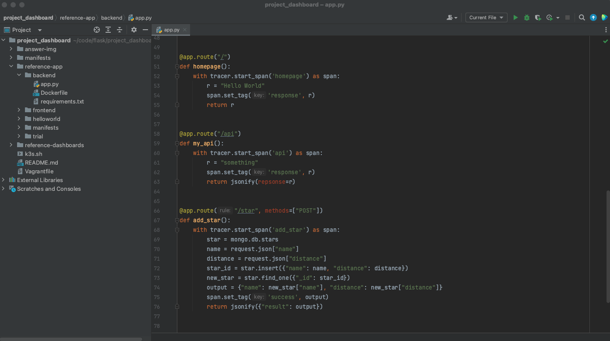

**Note:** For the screenshots, you can store all of your answer images in the `answer-img` directory.

## Verify the monitoring installation

*TODO:* run `kubectl` command to show the running pods and services for all components. Take a screenshot of the output and include it here to verify the installation

## Setup the Jaeger and Prometheus source
*TODO:* Expose Grafana to the internet and then setup Prometheus as a data source. Provide a screenshot of the home page after logging into Grafana.

## Create a Basic Dashboard
*TODO:* Create a dashboard in Grafana that shows Prometheus as a source. Take a screenshot and include it here.

## Describe SLO/SLI
*TODO:* Describe, in your own words, what the SLIs are, based on an SLO of *monthly uptime* and *request response time*.

The Service-Level Indicators (SLIs) are the key measurements to determine the availability of Service-Level Objectives (SLOs). By monitoring and measuring the SLIs, we can assess whether our service meets its intended objective defined in the SLOs. If the SLIs go below the specified SLO, we need to take action.

The SLI for the monthly uptime measures the availability and reliability of service over a period of a month. It is typically expressed as a percentage, where 100% indicates continuous uptime.

The SLI for the request-response time measures the speed and efficiency of service in handling incoming requests. It typically quantifies the time it takes for a service to respond to requests.

## Creating SLI metrics.
*TODO:* It is important to know why we want to measure certain metrics for our customer. Describe in detail 5 metrics to measure these SLIs.

1. Downtime Duration

The downtime duration measures the time the service is unavailable or experiences disruptions during a month. Examples are outages, maintenance windows, or other interruptions in service.

2. Uptime Percentage:

The uptime percentage is the most common SLI for uptime. It calculates the percentage of time the service was available during a given time. The formula for calculating uptime percentage is (Total time - Downtime) / total time * 100.

3. Availability Events
Availability Events count the number of times a service goes down during a given time and record the duration of each event. It helps in understanding the frequency and impact of downtime incidents.

Possible metrics to measure request response time:

1. Traffic
The number of HTTP requests for a given time measures the Traffic. It gives an overview of the amount of stress on a system from demand.

2. Maximum Response Time
The maximum response time measures the longest time processing a request during a specific period. It's essential to monitor and identify any extreme cases of slow response times that may affect user experience.

3. Error Rates
The error rate measures the percentage of requests that result in errors or failures. High error rates can significantly impact the user experience.

## Create a Dashboard to measure our SLIs
*TODO:* Create a dashboard to measure the uptime of the frontend and backend services. We will also want to measure to measure 40x and 50x errors. Create a dashboard that show these values over a 24 hour period and take a screenshot.

## Tracing our Flask App
*TODO:*  We will create a Jaeger span to measure the processes on the backend. Once you fill in the span, provide a screenshot of it here. Also provide a (screenshot) sample Python file containing a trace and span code used to perform Jaeger traces on the backend service.

## Jaeger in Dashboards
*TODO:* Now that the trace is running, let's add the metric to our current Grafana dashboard. Once this is completed, provide a screenshot of it here.

## Report Error
*TODO:* Using the template below, write a trouble ticket for the developers, to explain the errors that you are seeing (400, 500, latency) and to let them know the file that is causing the issue also include a screenshot of the tracer span to demonstrate how we can user a tracer to locate errors easily.

TROUBLE TICKET

Name: 500 Server Error Backend API

Date: October 27 2023, 14:25:01

Subject: 'NoneType' object is not subscriptable

Affected Area:  File "/app/app.py", line 70, in add_star
                    name = request.json["name"]

Severity: High

Description: We observed a new 500 Server Error in the backend, caused by a "add_star" Post request.

## Creating SLIs and SLOs
*TODO:* We want to create an SLO guaranteeing that our application has a 99.95% uptime per month. Name four SLIs that you would use to measure the success of this SLO.

1. Uptime Percentage:

The uptime percentage is the most common SLI for uptime. It calculates the percentage of time the service was available during a given time. The formula for calculating uptime percentage is (Total time - Downtime) / total time * 100.

2. Response Times

The downtime duration measures the time the service is unavailable or experiences disruptions during a month. Examples are outages, maintenance windows, or other interruptions in service.

3. Error Rate
Availability Events count the number of times a service goes down during a given time and record the duration of each event. It helps in understanding the frequency and impact of downtime incidents.

4. Saturation
The saturation measures the percentage of memory or CPU used. It shows the overall capacity of services.

## Building KPIs for our plan
*TODO*: Now that we have our SLIs and SLOs, create a list of 2-3 KPIs to accurately measure these metrics as well as a description of why those KPIs were chosen. We will make a dashboard for this, but first write them down here.

1. Uptime Percentage
- uptime > 99.95 % / month
- uptime > 95 % / day
Uptime percentage directly aligns with the concept of uptime, making it a widely accepted and straightforward KPI. It's a simple way to communicate the reliability of our service to stakeholders and users. The daily uptime should have a higher tolerance for scheduled events like maintenance.

2. Response Time
- avg response time < 100ms
- max response time 200ms
Overall, we want fast response times to ensure a great user experience. Services with slower response times are candidates for optimization.

3. Error Rates
- 95% Successful Requests
- less than 1% 50x Errors
50x are likely internal issues and should be fixed immediately to ensure a great user experience. 40x Errors are often caused by external factors like user typos, wrong set links in external sources, or bots searching the internet. Wrong internal linking or routing errors will generate more than usual unsuccessful requests and should be fixed immediately.

4. Saturation
- avergae CPU usage < 90 %
- average memory usage < 90 %
The services should have enough resources to run smoothly, while they also should keep a relatively higher usage level to run cost-effectively.

## Final Dashboard
*TODO*: Create a Dashboard containing graphs that capture all the metrics of your KPIs and adequately representing your SLIs and SLOs. Include a screenshot of the dashboard here, and write a text description of what graphs are represented in the dashboard.  

### Saturation
- CPU Usage (for each container)
- Memory Usage (average of all containers, total)

### Response Times
- Response Times per Request (Frontend, Backend)
- Average Response Time (Frontend+Backend)

### Uptime
- Uptime Percentage per Day (Frontend, Backend)
- Average Uptime Percentage per Month (Cluster)

### Error Rates
- Percentage Status Code Response Types (Frontend)
- Percentage Status Code Response Types (Backend)